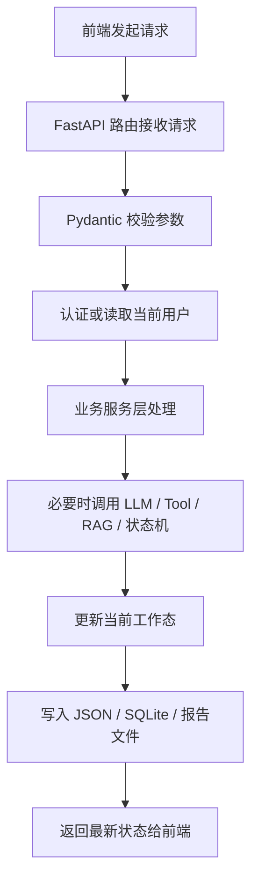
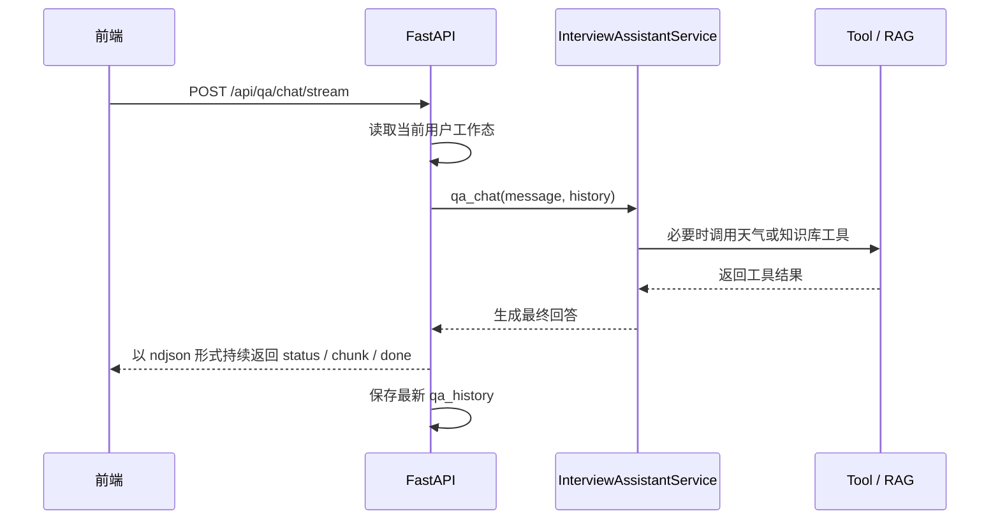
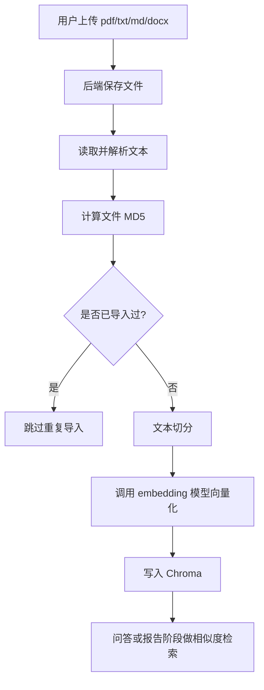

# 后端代码解读

## 1. 后端整体定位

后端是整个系统的核心业务层，负责把前端页面操作转成真正的业务执行。

当前后端除了原本的问答、模拟面试和 RAG 能力外，还承担了更正式的产品职责：

1. 提供注册登录、历史记录、报告下载等 HTTP 接口。
2. 管理登录用户、工作态状态、历史面试记录和报告文件。
3. 调用大模型完成问答、提问、评分和报告生成。
4. 管理知识库，包括文档解析、向量化、检索和 RAG。
5. 组织 Tool Calling、状态机决策和 LangSmith tracing。

一句话理解：

> 后端决定“用户怎么登录、问题怎么答、面试怎么推进、历史怎么存、报告怎么导出”。

---

## 2. 后端技术栈

### 2.1 FastAPI

整个后端 Web 框架是：

- `FastAPI`

负责：

- 定义接口路由
- 接收 JSON 和文件上传
- 参数校验
- 返回 JSON / 文件 / 流式响应
- 托管前端静态页面

### 2.2 Python

Python 实现了几乎所有业务逻辑，包括：

- 用户登录与会话管理
- 问答逻辑
- 面试逻辑
- 文件处理
- 向量库管理
- 状态持久化
- LangSmith 配置

### 2.3 LangChain

LangChain 在项目里主要负责：

- 封装聊天模型调用
- Prompt 编排
- Tool Calling
- RAG 检索后生成

### 2.4 Chroma

Chroma 是项目使用的向量数据库，负责：

- 保存切分后的文档块
- 保存 embedding 向量
- 提供相似度检索

### 2.5 DeepSeek / SiliconFlow

当前聊天模型和 embedding 服务通过 SiliconFlow 接入，承担：

- 技术问答
- Tool Calling 决策
- 模拟面试问题生成
- 回答评分
- 面试报告生成

### 2.6 SQLite

SQLite 是这版新增的正式持久化部分，主要用来保存：

- 用户表
- 登录会话表
- 历史面试记录表

### 2.7 LangSmith

LangSmith 用于观测和调试链路，帮助查看：

- Prompt
- 模型输入输出
- 工具调用过程
- 哪一步耗时长
- 哪一步可能跑偏

---

## 3. 后端代码结构

### 3.1 `main.py`

这是后端入口，负责：

- 创建 FastAPI 应用
- 配置 CORS 和前端静态资源托管
- 定义认证、问答、面试、历史记录和下载接口
- 初始化 SQLite
- 统一异常处理

### 3.2 `utils/auth_store.py`

这是这版新增的数据层模块，负责：

- 初始化 SQLite 表结构
- 创建用户
- 校验用户密码
- 创建和删除登录会话
- 读取当前登录用户
- 保存和查询历史面试记录

### 3.3 `utils/user_history_store.py`

负责当前用户工作态的本地持久化，主要保存：

- `qa_history`
- `interview_history`
- `interview_state`
- `resume_text`
- `resume_filename`
- `interview_score`
- `interview_report`
- `interview_report_file`

也就是说：

- SQLite 更偏“正式业务数据”
- JSON 更偏“当前工作态快照”

### 3.4 `agent/interview_assistant_service.py`

这是 AI 业务层核心文件，负责：

- 问答模式执行
- Tool Calling 执行
- 模拟面试问题生成
- 面试中的回复策略生成
- 分数计算
- 报告生成

### 3.5 `agent/interview_state_machine.py`

这是面试状态机，负责控制：

- 继续追问
- 提示
- 切题
- 结束

### 3.6 `rag/vector_store.py`

这是知识库模块，负责：

- 读取文档
- 解析文档
- 文本切分
- embedding
- 写入 Chroma
- MD5 去重

### 3.7 `utils/langsmith_handler.py`

负责：

- LangSmith 开关
- tracing 上下文
- 环境变量读取

---

## 4. 系统整体后端流程

---

## 5. `main.py` 现在负责什么

### 5.1 它是后端 API 入口

当前比较关键的接口包括：

#### 认证与用户

- `POST /api/auth/register`
- `POST /api/auth/login`
- `POST /api/auth/logout`
- `GET /api/auth/me`
- `GET /api/bootstrap`

#### 问答与面试

- `POST /api/qa/chat`
- `POST /api/qa/chat/stream`
- `POST /api/qa/clear`
- `POST /api/interview/start`
- `POST /api/interview/message`
- `POST /api/interview/message/stream`
- `POST /api/interview/end`
- `POST /api/interview/report`

#### 文件与知识库

- `POST /api/knowledge/import`
- `POST /api/resume/upload`
- `POST /api/resume/clear`

#### 历史记录与报告

- `GET /api/history/interviews`
- `GET /api/history/interviews/{record_id}`
- `POST /api/history/interviews/{record_id}/restore`
- `GET /api/history/interviews/{record_id}/download`
- `GET /api/interview/report/download`

### 5.2 它也是前端入口

后端不仅提供 API，还负责：

- `GET /` 返回前端入口
- `app.mount("/frontend-assets", StaticFiles(...))` 托管前端静态资源

所以现在是：

> FastAPI 同时负责后端接口和前端构建产物托管。

### 5.3 它会做初始化恢复

`/api/bootstrap` 是页面初始化最关键的接口。

它会返回：

- 当前登录态
- 当前用户工作态
- 历史面试记录列表
- 当前天气
- 页面文案
- LangSmith 配置

这样页面刷新后既不会丢登录态，也不会完全丢失上下文。

---

## 6. 用户体系是怎么做的

这版已经不再是“只输入用户名”的轻量模式，而是正式登录体系。

### 注册登录流程

1. 前端提交邮箱和密码
2. 后端在 SQLite 的 `users` 表里创建或校验用户
3. 登录成功后创建 `user_sessions`
4. 后端通过 Cookie 把会话标识返回给前端
5. 后续请求通过 Cookie 识别当前用户

### 为什么选 Cookie 会话

因为当前项目是前后端同域部署，Cookie 会话实现简单，也更适合这种中小型产品化场景。

---

## 7. 当前工作态和历史记录分别存在哪里

这是这版后端的一个重要设计点。

### 7.1 当前工作态

保存在：

- `data/user_histories/`

特点：

- 每个用户一份 JSON
- 保存当前问答历史、当前面试状态、当前报告、简历文本等
- 更适合做页面恢复和中断恢复

### 7.2 正式业务数据

保存在：

- `data/app.db`

表结构主要包括：

- `users`
- `user_sessions`
- `interview_records`

特点：

- 更适合做历史记录列表、报告归档、按用户查询

### 7.3 报告文件

独立保存到：

- `data/interview_reports/`

也就是说，报告现在有三层落地：

1. 当前工作态 JSON
2. SQLite 历史记录
3. Markdown 文件导出

---

## 8. 问答模式后端怎么跑

问答流式接口是：

- `POST /api/qa/chat/stream`

流程如下：

### 新增的继续生成 / 重试逻辑

这版后端支持两种恢复方式：

- `action = "resume"`
  - 基于上一轮中断内容继续往下生成

- `action = "retry"`
  - 基于上一轮用户消息重新完整生成一遍

---

## 9. 模拟面试后端怎么跑

模拟面试主要接口：

- `POST /api/interview/start`
- `POST /api/interview/message/stream`
- `POST /api/interview/end`
- `POST /api/interview/report`

### 9.1 开始面试

后端会：

1. 初始化面试状态机
2. 记录目标岗位
3. 记录是否有简历
4. 生成第一道题
5. 返回第一条面试官消息

### 9.2 面试中

用户回答后，后端会：

1. 判断当前回答意图
2. 对回答做质量评分
3. 查看当前题追问次数
4. 查看总题数是否达到上限
5. 交给状态机做下一步决策
6. 再生成追问、提示、下一题或结束语

### 9.3 流式输出

`/api/interview/message/stream` 返回的是按行推送的事件流，常见事件有：

- `status`
- `chunk`
- `done`
- `error`

其中 `status` 用来给前端显示：

- 正在分析简历
- 正在评估你的回答
- 正在生成下一轮提问

---

## 10. 报告生成和历史记录怎么落地

`POST /api/interview/report` 执行时，后端会：

1. 计算当前面试得分
2. 调用 LangChain 报告链生成结构化报告
3. 将报告保存为独立 Markdown 文件
4. 将这次面试记录写入 SQLite 的 `interview_records`
5. 将当前工作态里的 `interview_report` 和 `interview_report_file` 更新

之后前端可以：

- 查看最新报告
- 下载最新报告
- 从历史记录列表查看旧报告
- 恢复旧记录到当前工作台

---

## 11. 为什么要做状态机

如果不加状态机，模型容易出现这些问题：

- 一直围绕一个问题追问
- 问题切换不自然
- 不知道什么时候结束
- 面试节奏不稳定

状态机控制的是：

- 当前是继续追问还是切题
- 是否先给提示
- 是否已经达到结束条件

当前比较关键的规则有：

- 单题最多追问 2 次
- 整场面试最多 8 题
- 连续答得较差时优先切题
- 用户偏题或卡住时可以给提示

---

## 12. 中断兜底是怎么做的

`main.py` 里有一个很重要的逻辑：

- `normalize_pending_messages()`

它会检查历史消息里是否存在：

- `assistant`
- `status == "generating"`

如果有，就把它改成：

- `interrupted`

并补一条中断说明。

意义：

- 避免页面刷新后永远卡在“生成中”
- 让用户知道这条消息是被中断的
- 为“继续生成 / 重试本轮回答”提供基础状态

---

## 13. RAG 是怎么实现的

RAG 主要在：

- `rag/vector_store.py`

流程如下：

### 为什么要做 MD5 去重

因为用户可能重复上传同一个文件。

如果不去重：

- 向量库会越来越冗余
- 检索结果会重复
- 回答质量可能下降

---

## 14. LangSmith 是怎么接入的

LangSmith 是可开关的调试能力。

后端通过：

- `utils/langsmith_handler.py`

统一控制 tracing 开关。

目前主要包裹这些链路：

- 问答
- 知识库导入
- 模拟面试开始
- 面试过程
- 报告生成

这样你可以在 LangSmith 平台上看到：

- Prompt
- 模型输出
- 工具调用
- 整体链路

---

## 15. 一句话总结

> 当前后端是一个基于 `FastAPI + LangChain + SQLite + Chroma` 的 AI 应用服务层，既负责正式用户体系、历史记录和报告归档，也负责 Tool Calling、RAG、状态机和流式问答 / 面试能力。
