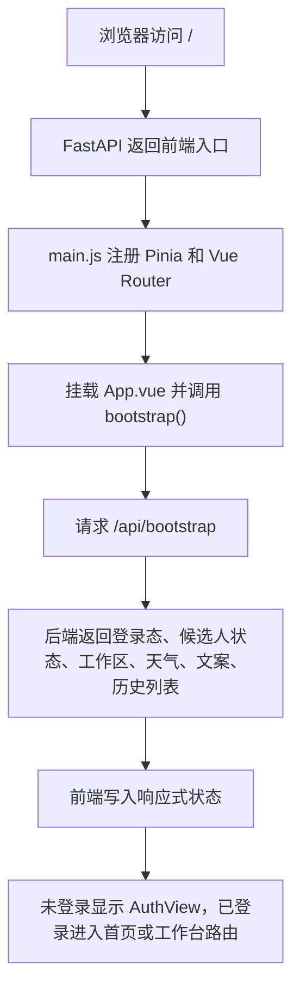
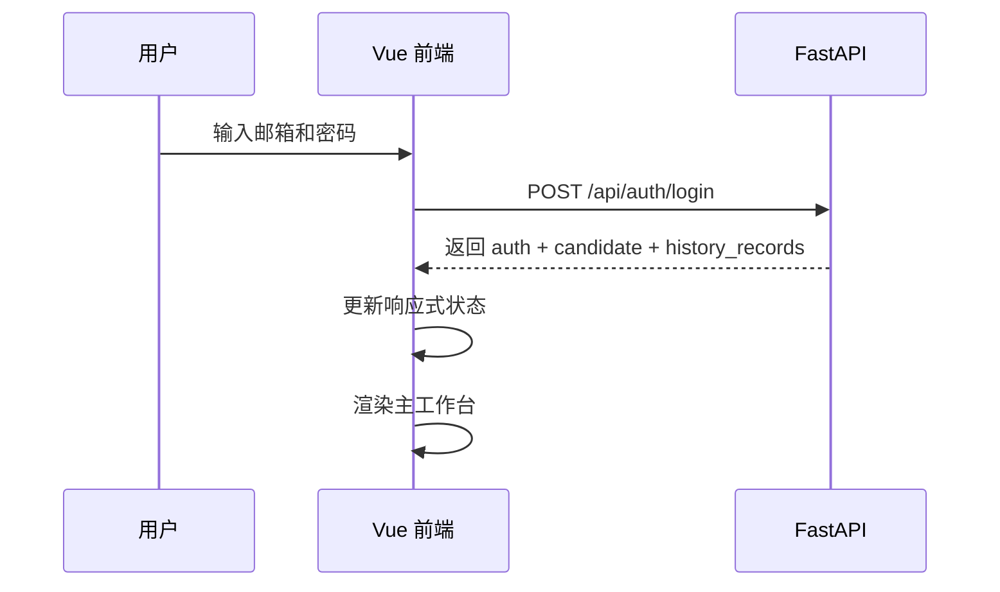
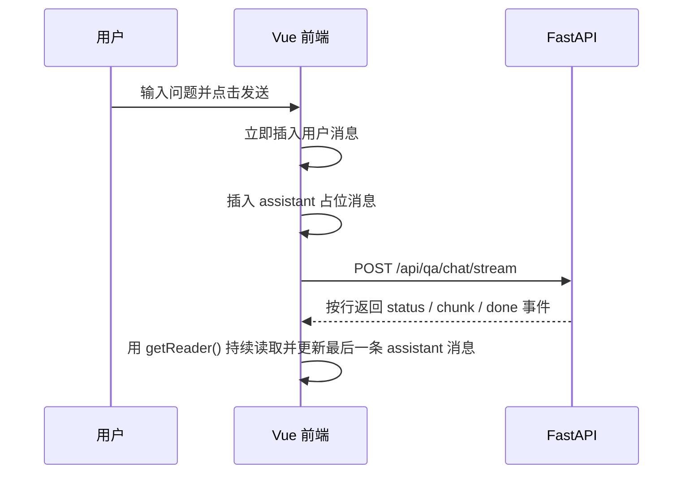
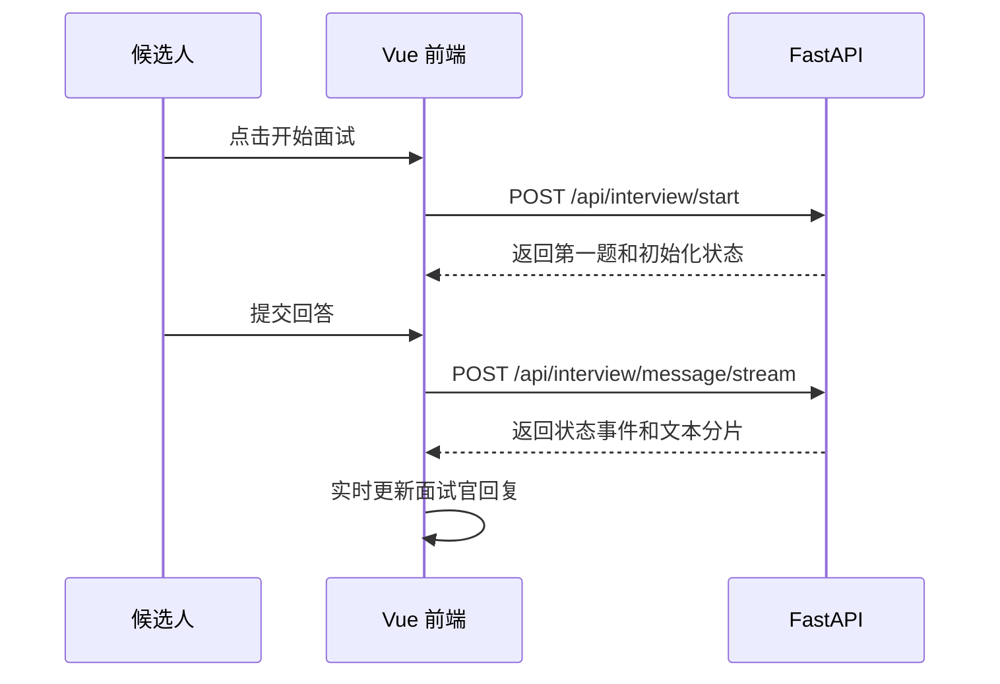
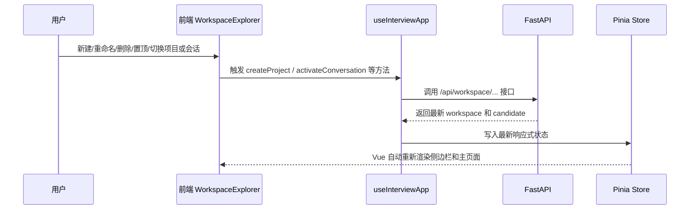

# 前端代码解读

## 1. 前端整体定位

当前前端使用 `Vue 3 + Vite + Vue Router + Pinia + JavaScript + CSS` 实现，采用单文件组件（`.vue`）组织页面结构。

现在的前端不再只是一个聊天界面，而是一个更完整的前端工作台，主要负责：

1. 展示登录页、首页落地页、问答页、模拟面试页、历史记录页。
2. 管理登录态、模式切换、项目/会话、文件上传、历史记录查看和报告下载。
3. 通过 `Vue Router` 控制首页、工作台和不同模式页面的跳转。
4. 通过 `axios` 发起普通 HTTP 请求，通过 `fetch + ReadableStream` 处理流式响应。
5. 接收后端数据并驱动页面状态自动更新。
6. 处理长列表展示、自动滚动、骨架屏、懒加载、主题切换和移动端适配。

一句话理解：

> 前端负责“页面怎么展示、用户怎么操作、数据怎么和后端联动，以及交互体验怎么更像正式产品”。

---

## 2. 前端技术栈

### 2.1 Vue 3

Vue 3 负责：

- 组件化开发
- 响应式状态管理
- 条件渲染
- 列表渲染
- 表单绑定
- 异步组件懒加载

### 2.2 Vue Router

Vue Router 负责页面级跳转：

- `/`：首页落地页，负责展示模式入口和产品介绍。
- `/workspace/qa`：问答模式工作台。
- `/workspace/interview`：模拟面试工作台。
- `/workspace/history`：历史复盘页面。

它的作用是把“页面状态”从单纯的按钮切换升级成正式路由。这样用户刷新页面、复制地址或从首页进入某个模式时，前端都能根据 URL 恢复到对应页面。

### 2.3 Pinia

Pinia 是当前项目的正式状态管理层，主要保存：

- 当前登录用户。
- 当前候选人状态。
- 当前模式。
- 工作区、项目和会话列表。
- 上传状态、报告列表、LangSmith 调试状态。
- 流式回复、loading、错误提示等 UI 状态。

简单理解：`Pinia` 负责“状态放在哪里”，`useInterviewApp.js` 负责“用户操作之后怎么调用接口、怎么修改状态”。

### 2.4 JavaScript

JavaScript 负责业务逻辑，比如：

- 注册登录
- 模式切换
- 首页跳转
- 项目/会话管理
- 文件上传
- 请求发送与状态更新
- 流式读取与中断恢复
- 错误提示归一化
- 防抖节流

### 2.5 CSS

样式统一放在：

- `frontend/src/styles.css`

负责：

- 整体布局
- 聊天气泡
- 侧边栏样式
- 顶部天气区
- 输入区和按钮样式
- 骨架屏
- 历史记录页
- 移动端适配

---

## 3. 前端目录结构

### 3.1 页面入口

- `frontend/index.html`
  - 提供 `#app` 挂载点
- `frontend/src/main.js`
  - 调用 `createApp(App)`
  - 注册 `Pinia` 和 `Vue Router`
  - 最后挂载到 `#app`

- `frontend/src/router/index.js`
  - 定义首页和工作台路由
  - 把 `/workspace/qa`、`/workspace/interview`、`/workspace/history` 映射到不同业务模式

### 3.2 页面与视图层

- `frontend/src/App.vue`
  - 前端根组件
  - 负责登录态分流、路由分流、首次引导弹窗和主工作台骨架

- `frontend/src/views/AuthView.vue`
- `frontend/src/views/LandingView.vue`
- `frontend/src/views/QaView.vue`
- `frontend/src/views/InterviewView.vue`
- `frontend/src/views/HistoryView.vue`
  - 这层是“页面视图层”
  - 主要负责把页面级 props、事件和下层组件连接起来
  - 让 `App.vue` 只做编排，不直接承载太多业务细节

### 3.3 组件目录

- `frontend/src/components/AuthPanel.vue`
  - 登录 / 注册页

- `frontend/src/components/AppSidebar.vue`
  - 侧边栏组件
  - 负责显示用户信息、模式入口、主题选择、知识库导入、LangSmith 调试入口和工作区会话树

- `frontend/src/components/WorkspaceExplorer.vue`
  - 项目/会话树组件
  - 支持新建项目、新建会话、重命名、删除、置顶和切换

- `frontend/src/components/ModeHeader.vue`
  - 顶部模式标题、天气和进度提示区

- `frontend/src/components/QaPanel.vue`
  - 问答模式页面

- `frontend/src/components/InterviewPanel.vue`
  - 模拟面试模式页面

- `frontend/src/components/HistoryPanel.vue`
  - 历史面试记录列表页

- `frontend/src/components/ChatHistory.vue`
  - 聊天记录渲染
  - 内部实现了长列表渐进展示和自动滚动控制

- `frontend/src/components/WelcomePanel.vue`
  - 欢迎语和空状态

- `frontend/src/components/PanelSkeleton.vue`
  - 骨架屏和占位态

- `frontend/src/components/OnboardingModal.vue`
  - 首次进入首页时的引导弹窗
  - 帮用户理解“技术问答 / 模拟面试 / 历史复盘”分别适合什么场景

### 3.4 业务逻辑目录

- `frontend/src/composables/useInterviewApp.js`
  - 整个前端最核心的状态编排和交互逻辑

- `frontend/src/stores/appStore.js`
  - 基于 Pinia 的正式状态管理层
  - 统一管理登录态、当前候选人、模式切换、工作区项目/会话、历史记录、LangSmith 状态和流式回复状态

### 3.5 共享模块

- `frontend/src/api/client.js`
  - API 请求封装
  - 普通请求走 `axios`
  - 流式请求走 `fetch`

- `frontend/src/constants.js`
  - 兼容旧导入路径

- `frontend/src/constants/app.js`
  - 模式枚举、主题枚举、加载动作、消息状态、错误文案、默认状态工厂

- `frontend/src/types/app.js`
  - 使用 JSDoc 统一描述消息结构、认证结构、天气结构、工作区结构、历史记录结构等前端数据模型

- `frontend/src/utils/clone.js`
  - 深拷贝辅助函数

- `frontend/src/utils/timing.js`
  - `debounce` / `throttle` 工具函数

---

## 4. 页面启动流程

---

## 5. 页面状态是怎么设计的

现在前端状态不再只靠单个 composable 保存，而是拆成：

- `frontend/src/stores/appStore.js`
  - 真正保存状态
- `frontend/src/composables/useInterviewApp.js`
  - 负责调用接口、处理流式响应、组织交互动作

可以把它理解成：

- `store` 负责“状态放哪里”
- `composable` 负责“动作怎么执行”

### 5.1 基础状态

- `bootstrapping`
  - 页面是否还在初始化

- `auth`
  - 当前是否已登录、当前用户是谁

- `candidate`
  - 当前用户的工作态
  - 包含问答历史、面试历史、简历、报告、面试状态等

- `workspace`
  - 当前用户的项目和会话树
  - 包含 `active_project_id`、`active_conversation_id`、`projects`
  - 侧边栏会根据它渲染项目文件夹和会话列表

- `activeProject` / `activeConversation`
  - 从 `workspace` 派生出来的计算状态
  - 当前激活 ID 变化后，页面会自动拿到新的项目和会话

- `themeMode`
  - 当前主题模式
  - 可选严肃面试官、轻量练习、冲刺复习
  - 前端通过主题 class 让 CSS 自动切换视觉风格

- `weather`
  - 当前天气信息

- `meta`
  - 当前页面模式相关文案

- `historyRecords`
  - 历史面试记录列表

- `selectedHistoryRecord`
  - 当前选中的历史记录详情

### 5.2 用户输入和文件状态

- `loginForm`
- `registerForm`
- `qaInput`
- `interviewInput`
- `knowledgeFiles`
- `resumeFile`

### 5.3 系统行为状态

- `loadingAction`
  - 当前正在执行的操作

- `progressMessage`
  - 顶部细粒度进度提示
  - 比如“正在分析简历”“正在生成报告”

- `typingState`
  - 当前流式输出的控制器和消息位置

- `stopRequested`
  - 是否请求中断当前回复

- `errorMessage`
  - 当前错误信息

- `langsmith`
  - LangSmith 调试开关和配置

---

## 6. 组件是怎么拆分的

### 6.1 `App.vue`

这是根组件，负责：

- 判断显示登录页还是主工作台
- 根据 `mode` 渲染问答页、模拟面试页或历史记录页
- 统一挂载侧边栏和顶部模式栏

现在它本身不再直接操作太多组件细节，而是优先挂载 `views` 层。

### 6.2 `views/*.vue`

这一层负责：

- 对接 Pinia / composable 暴露出来的状态
- 把页面级事件继续传给展示组件
- 作为后续接入 `vue-router` 时的天然过渡层

### 6.3 `AuthPanel.vue`

负责：

- 登录 / 注册表单
- 切换登录或注册模式
- 触发 `login()` / `register()`

### 6.4 `AppSidebar.vue`

负责：

- 显示当前登录用户
- 退出登录
- 导入知识库
- 配置 LangSmith
- 切换问答 / 模拟面试 / 历史记录模式

### 6.5 `ModeHeader.vue`

负责顶部固定区域：

- 当前模式标题
- 模式说明
- 当前天气
- 当前进度提示

### 6.6 `QaPanel.vue`

负责问答模式页面：

- 问答欢迎区
- 问答历史
- 发送输入框
- 停止回复按钮
- 继续生成 / 重试本轮回答

### 6.7 `InterviewPanel.vue`

负责模拟面试页面：

- 岗位选择
- 简历上传
- 开始 / 结束面试
- 当前岗位与简历状态
- 面试历史
- 分数与报告
- 继续生成 / 重试本轮回答

### 6.8 `HistoryPanel.vue`

负责历史记录页面：

- 左侧显示历史记录列表
- 右侧显示报告详情和历史对话
- 支持恢复历史记录到当前面试工作台

### 6.9 `ChatHistory.vue`

负责统一渲染消息列表，并做了两类体验优化：

- 长列表优化：默认只显示最近一部分消息，支持“加载更早消息”
- 自动滚动优化：只有用户停留在底部附近时，新增消息才自动滚到底

---

## 7. 前端核心交互流程

### 7.1 登录流程

### 7.2 问答发送流程

### 7.3 模拟面试流程

### 7.4 历史记录流程

- 切到历史记录模式
- 前端请求 `/api/history/interviews`
- 点击某条记录后请求 `/api/history/interviews/{record_id}`
- 需要复盘时调用 `/api/history/interviews/{record_id}/restore`

### 7.5 首页和路由跳转流程

可以直接记这 5 步：

1. 用户登录成功后进入 `/` 首页。
2. 首页 `LandingView.vue` 展示“技术问答 / 模拟面试 / 历史复盘”三个入口。
3. 用户点击入口后，前端调用 `router.push()` 跳转到 `/workspace/qa`、`/workspace/interview` 或 `/workspace/history`。
4. `App.vue` 根据当前路由和 `mode` 渲染对应页面。
5. 如果会话需要记录当前模式，前端会调用接口保存会话偏好的模式。

这个设计的好处是：模式切换不再只是一个按钮状态，而是和 URL 绑定，更接近真实前端项目。

### 7.6 首次引导流程

可以直接记这 4 步：

1. `/api/bootstrap` 返回 `workspace.onboarding_completed`。
2. 如果该字段是 `false`，`App.vue` 显示 `OnboardingModal.vue`。
3. 用户点击“下一步”或“跳过”后，前端调用 `POST /api/workspace/onboarding`。
4. 后端保存引导完成状态，前端更新 `workspace`，之后再次进入就不再弹出。

### 7.7 项目和会话管理流程

项目/会话管理主要由 `WorkspaceExplorer.vue` 负责展示，由 `useInterviewApp.js` 负责调用接口。

这里最核心的点是：前端不自己猜测最终状态，而是每次操作后以接口返回的最新 `workspace` 为准，这样可以避免前后端状态不一致。

### 7.8 主题模式切换流程

可以直接记这 4 步：

1. 用户在侧边栏选择“严肃面试官 / 轻量练习 / 冲刺复习”。
2. 前端把选择写入 Pinia 的 `themeMode`。
3. `App.vue` 根据 `themeMode` 给页面根容器添加不同 class。
4. `styles.css` 根据 class 切换颜色、卡片氛围和视觉强调。

这个主题目前主要影响前端视觉体验，后续也可以扩展成同时影响 Prompt 语气。

---

## 8. 前端怎么获取后端数据

接口封装在：

- `frontend/src/api/client.js`

主要方法有：

- `apiGet(path)`
- `apiPost(path, body)`
- `apiPatch(path, body)`
- `apiDelete(path)`
- `apiFormPost(path, formData)`
- `apiStreamPost(path, body, signal)`

### 当前请求分工

- 普通接口：`axios`
  - 登录
  - 历史记录
  - 报告生成
  - 简历上传
  - 知识库导入
  - 项目/会话的新建、重命名、删除、置顶和切换

- 流式接口：`fetch`
  - `/api/qa/chat/stream`
  - `/api/interview/message/stream`

这样做的原因是：

- `axios` 更适合普通业务接口和统一错误处理
- `fetch` 更适合直接读取 `response.body` 流

---

## 9. 当前流式输出是怎么做的

现在不是伪流式，而是真正的 HTTP 流式响应。

核心逻辑在：

- `frontend/src/composables/useInterviewApp.js`

前端会：

1. 调用流式接口
2. 通过 `response.body.getReader()` 拿到读取器
3. 使用 `TextDecoder` 解析后端返回的文本分片
4. 按行解析 `status / chunk / done / error` 事件
5. 每拿到一段 `chunk`，就立即更新最后一条 assistant 消息

### 为什么要单独保留占位消息

因为流式输出不是瞬间完成的。

占位消息的作用：

- 让用户立刻看到系统正在响应
- 给流式更新预留渲染位置
- 中断时方便标记 `interrupted`

---

## 10. 这版前端新增了哪些工程化优化

### 10.1 长列表优化

在 `ChatHistory.vue` 里：

- 默认只渲染最近 `80` 条消息
- 顶部可点击“加载更早消息”
- 减少一次性渲染大量 DOM 节点带来的压力

### 10.2 自动滚动优化

在 `ChatHistory.vue` 里：

- 通过滚动位置判断用户是否还停留在底部附近
- 只有在底部附近时，新增消息才自动滚到底
- 避免用户回看旧消息时被强制拉回底部

### 10.3 防抖节流

在 `frontend/src/utils/timing.js` 里：

- `throttle` 用于滚动事件
- `debounce` 用于历史记录刷新和 resize 后的滚动修正

### 10.4 懒加载

在 `App.vue` 里：

- `AuthPanel`
- `QaPanel`
- `InterviewPanel`
- `HistoryPanel`

都通过 `defineAsyncComponent` 懒加载，减少首屏压力。

### 10.5 骨架屏与占位态

新增：

- `frontend/src/components/PanelSkeleton.vue`

用于：

- 启动加载
- 历史记录加载

### 10.6 更细的错误提示

在 `useInterviewApp.js` 里新增了 `normalizeErrorMessage()`，会把：

- 登录失效
- 网络异常
- 请求超时
- 简历处理失败

这些错误转成更适合页面展示的文案。

### 10.7 移动端适配

在 `styles.css` 里补了：

- `@media (max-width: 960px)`
- `@media (max-width: 640px)`

主要调整：

- 侧边栏下沉
- 聊天气泡宽度收缩
- 表单改为纵向排列
- 卡片圆角和留白压缩

---

## 11. 面试时怎么介绍前端实现

你可以这样说：

> 前端我是用 Vue 3 + Vite 实现的，整体采用组件化开发方式，并引入 Vue Router 和 Pinia。Vue Router 负责首页、问答模式、模拟面试模式和历史复盘之间的页面跳转；Pinia 负责统一保存登录态、候选人状态、项目/会话树、主题模式和流式回复状态。页面上我把登录页、首页落地页、侧边栏、项目会话管理、问答模块、模拟面试模块、历史记录模块都拆成独立 `.vue` 组件，业务动作集中放在 `useInterviewApp.js` 里。普通请求走 axios，流式回复保留 fetch，通过 `getReader()` 持续读取后端返回的 chunk，再实时更新页面。另外，我还补了首次引导、主题模式、长列表优化、自动滚动、防抖节流、骨架屏、懒加载和移动端适配，让这个项目更接近正式前端工程。  

---

## 12. 一句话总结

> 当前前端是一个基于 `Vue 3 + Vite + Vue Router + Pinia` 的组件化工作台，既承接问答和模拟面试这两个核心 AI 场景，也补上了登录、首页引导、项目/会话管理、历史记录、流式交互和体验优化这类正式产品能力。
